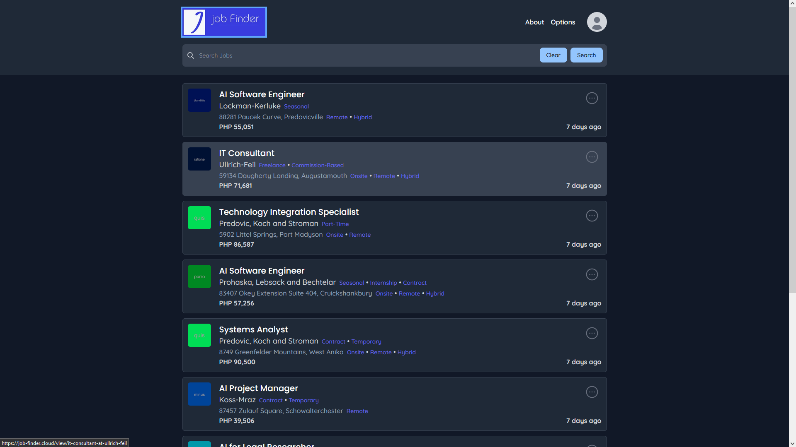

<!-- Improved compatibility of back to top link: See: https://github.com/othneildrew/Best-README-Template/pull/73 -->

<a name="readme-top"></a>

<!--
*** Thanks for checking out the Best-README-Template. If you have a suggestion
*** that would make this better, please fork the repo and create a pull request
*** or simply open an issue with the tag "enhancement".
*** Don't forget to give the project a star!
*** Thanks again! Now go create something AMAZING! :D
-->

<!-- PROJECT SHIELDS -->
<!--
*** I'm using markdown "reference style" links for readability.
*** Reference links are enclosed in brackets [ ] instead of parentheses ( ).
*** See the bottom of this document for the declaration of the reference variables
*** for contributors-url, forks-url, etc. This is an optional, concise syntax you may use.
*** https://www.markdownguide.org/basic-syntax/#reference-style-links
-->

[![Contributors][contributors-shield]][contributors-url]
[![Forks][forks-shield]][forks-url]
[![Stargazers][stars-shield]][stars-url]
[![Issues][issues-shield]][issues-url]
[![MIT License][license-shield]][license-url]
[![LinkedIn][linkedin-shield]][linkedin-url]

<!-- PROJECT LOGO -->
<br />
<div align="center">
  <a href="https://github.com/KenjinMean/job-finder-react-frontend">
    
  </a>

<h3 align="center">Job FInder</h3>

  <p align="center">
    Job Finder is a dynamic web application designed to help users find job listings. Built using React for the frontend and Laravel as the backend API, this project showcases my full-stack development skills and demonstrates the integration of various technologies to create a seamless user experience.
    <br />
    <a href="https://github.com/KenjinMean/job-finder-react-frontend"><strong>Explore the docs »</strong></a>
    <br />
    <br />
    <a href="https://github.com/KenjinMean/job-finder-react-frontend">View Demo</a>
    ·
    <a href="https://github.com/KenjinMean/job-finder-react-frontend/issues/new?labels=bug&template=bug-report---.md">Report Bug</a>
    ·
    <a href="https://github.com/KenjinMean/job-finder-react-frontend/issues/new?labels=enhancement&template=feature-request---.md">Request Feature</a>
  </p>
</div>

<!-- TABLE OF CONTENTS -->
<details>
  <summary>Table of Contents</summary>
  <ol>
    <li>
      <a href="#about-the-project">About The Project</a>
      <ul>
        <li><a href="#built-with">Built With</a></li>
      </ul>
    </li>
    <li>
      <a href="#getting-started">Getting Started</a>
      <ul>
        <li><a href="#prerequisites">Prerequisites</a></li>
        <li><a href="#installation">Installation</a></li>
      </ul>
    </li>
    <li><a href="#usage">Usage</a></li>
    <li><a href="#roadmap">Roadmap</a></li>
    <li><a href="#contributing">Contributing</a></li>
    <li><a href="#license">License</a></li>
    <li><a href="#contact">Contact</a></li>
    <li><a href="#acknowledgments">Acknowledgments</a></li>
  </ol>
</details>

<!-- ABOUT THE PROJECT -->

## About The Project

[](src/assets/app/home.PNG)

<!-- Here's a blank template to get started: To avoid retyping too much info. Do a search and replace with your text editor for the following: `KenjinMean`, `job-finder-react-frontend`, `twitter_handle`, `genesis-saquibal-9b99a5245/`, `gmail`, `genesisjinsaquibal`, `Job FInder`, `Job Finder is a dynamic web application designed to help users find job listings. Built using React for the frontend and Laravel as the backend API, this project showcases my full-stack development skills and demonstrates the integration of various technologies to create a seamless user experience.` -->

<p align="right">(<a href="#readme-top">back to top</a>)</p>

## Features

- **User-Friendly Interface:** Intuitive and responsive design for easy navigation.
- **Job Listings:** Display of job listings with detailed information.
- **Search Functionality:** Ability to search for jobs based on keywords and filters.
- **Bookmarking:** Users can save their favorite job listings for later reference.
- **Responsive Design:** Optimized for both desktop and mobile devices.
- **Backend Integration:** Laravel API for handling business logic, data management, and authentication processes.

### Built With

- [![Vite][Vite]][Vite-url]
- [![React][React.js]][React-url]
- [![ReactQuery][React.Query]][React-Query-url]
- [![ReactRouter][React.Router]][React-Router-url]
- [![ReactHookForm][React.Hook.Form]][React-Form-url]
- [![TailwindCSS][TailwindCSS]][TailwindCSS-url]
- [![Framer][Framer]][Framer-url]
- [Zustand](https://zustand-demo.pmnd.rs/)

  <!-- - [![Next][Next.js]][Next-url] -->
  <!-- - [![Vue][Vue.js]][Vue-url] -->
  <!-- - [![Angular][Angular.io]][Angular-url] -->
  <!-- - [![Svelte][Svelte.dev]][Svelte-url] -->
  <!-- - [![Laravel][Laravel.com]][Laravel-url] -->
  <!-- - [![Bootstrap][Bootstrap.com]][Bootstrap-url] -->
  <!-- - [![JQuery][JQuery.com]][JQuery-url] -->

<p align="right">(<a href="#readme-top">back to top</a>)</p>

<!-- GETTING STARTED -->

## Getting Started

This section and beyond is still a placeholders and under construction, please bear with me. Thank you :D

To get a local copy up and running follow these simple example steps.

### Prerequisites

This is an example of how to list things you need to use the software and how to install them.

- npm
  ```sh
  npm install npm@latest -g
  ```

### Installation

1. Get a free API Key at [https://example.com](https://example.com)
2. Clone the repo
   ```sh
   git clone https://github.com/KenjinMean/job-finder-react-frontend.git
   ```
3. Install NPM packages
   ```sh
   npm install
   ```
4. Enter your API in `config.js`
   ```js
   const API_KEY = "ENTER YOUR API";
   ```

<p align="right">(<a href="#readme-top">back to top</a>)</p>

<!-- USAGE EXAMPLES -->

## Usage

Use this space to show useful examples of how a project can be used. Additional screenshots, code examples and demos work well in this space. You may also link to more resources.

_For more examples, please refer to the [Documentation](https://example.com)_

<p align="right">(<a href="#readme-top">back to top</a>)</p>

<!-- ROADMAP -->

## Roadmap

- [ ] Registering Company
  - [ ] Implement company registration form
  - [ ] Validate company details
  - [ ] Store company information in the database
- [ ] Creating Job Postings
  - [ ] Develop job posting form
  - [ ] Add functionality to post jobs
  - [ ] Integrate job postings with the company's profile

See the [open issues](https://github.com/KenjinMean/job-finder-react-frontend/issues) for a full list of proposed features (and known issues).

<p align="right">(<a href="#readme-top">back to top</a>)</p>

<!-- CONTRIBUTING -->

## Contributing

Contributions are what make the open source community such an amazing place to learn, inspire, and create. Any contributions you make are **greatly appreciated**.

If you have a suggestion that would make this better, please fork the repo and create a pull request. You can also simply open an issue with the tag "enhancement".
Don't forget to give the project a star! Thanks again!

1. Fork the Project
2. Create your Feature Branch (`git checkout -b feature/AmazingFeature`)
3. Commit your Changes (`git commit -m 'Add some AmazingFeature'`)
4. Push to the Branch (`git push origin feature/AmazingFeature`)
5. Open a Pull Request

<p align="right">(<a href="#readme-top">back to top</a>)</p>

<!-- LICENSE -->

## License

Distributed under the MIT License. See `LICENSE.txt` for more information.

<p align="right">(<a href="#readme-top">back to top</a>)</p>

<!-- CONTACT -->

## Contact

<!--
Your Name - [@twitter_handle](https://twitter.com/twitter_handle) - genesisjinsaquibal@gmail.com -->

Genesis Saquibal - genesisjinsaquibal@gmail.com

Project Link: [https://github.com/KenjinMean/job-finder-react-frontend](https://github.com/KenjinMean/job-finder-react-frontend)

<p align="right">(<a href="#readme-top">back to top</a>)</p>

<!-- ACKNOWLEDGMENTS -->

## Acknowledgments

- [Best README Template](https://github.com/othneildrew/Best-README-Template/tree/master)
- [Choose an Open Source License](https://choosealicense.com)
- [GitHub Emoji Cheat Sheet](https://www.webpagefx.com/tools/emoji-cheat-sheet)
- [Malven's Flexbox Cheatsheet](https://flexbox.malven.co/)
- [Malven's Grid Cheatsheet](https://grid.malven.co/)
- [Img Shields](https://shields.io)
- [GitHub Pages](https://pages.github.com)
- [Font Awesome](https://fontawesome.com)
- [React Icons](https://react-icons.github.io/react-icons/search)
<!-- - []()


- []()
- []() -->

<p align="right">(<a href="#readme-top">back to top</a>)</p>

<!-- MARKDOWN LINKS & IMAGES -->
<!-- https://www.markdownguide.org/basic-syntax/#reference-style-links -->

[contributors-shield]: https://img.shields.io/github/contributors/KenjinMean/job-finder-react-frontend.svg?style=for-the-badge
[contributors-url]: https://github.com/KenjinMean/job-finder-react-frontend/graphs/contributors
[forks-shield]: https://img.shields.io/github/forks/KenjinMean/job-finder-react-frontend.svg?style=for-the-badge
[forks-url]: https://github.com/KenjinMean/job-finder-react-frontend/network/members
[stars-shield]: https://img.shields.io/github/stars/KenjinMean/job-finder-react-frontend.svg?style=for-the-badge
[stars-url]: https://github.com/KenjinMean/job-finder-react-frontend/stargazers
[issues-shield]: https://img.shields.io/github/issues/KenjinMean/job-finder-react-frontend.svg?style=for-the-badge
[issues-url]: https://github.com/KenjinMean/job-finder-react-frontend/issues
[license-shield]: https://img.shields.io/github/license/KenjinMean/job-finder-react-frontend.svg?style=for-the-badge
[license-url]: https://github.com/KenjinMean/job-finder-react-frontend/blob/master/LICENSE.txt
[linkedin-shield]: https://img.shields.io/badge/-LinkedIn-black.svg?style=for-the-badge&logo=linkedin&colorB=555
[linkedin-url]: https://linkedin.com/in/genesis-saquibal-9b99a5245/
[product-screenshot]: images/screenshot.png
[Next.js]: https://img.shields.io/badge/next.js-000000?style=for-the-badge&logo=nextdotjs&logoColor=white
[Next-url]: https://nextjs.org/
[React.js]: https://img.shields.io/badge/React-20232A?style=for-the-badge&logo=react&logoColor=61DAFB
[React-url]: https://reactjs.org/
[React.Query]: https://img.shields.io/badge/-React%20Query-FF4154?style=for-the-badge&logo=react%20query&logoColor=white
[React-Query-url]: https://tanstack.com/query/v3
[React.Router]: https://img.shields.io/badge/React_Router-CA4245?style=for-the-badge&logo=react-router&logoColor=white
[React-Router-url]: https://reactrouter.com/en/main
[React.Hook.Form]: https://img.shields.io/badge/React%20Hook%20Form-%23EC5990.svg?style=for-the-badge&logo=reacthookform&logoColor=white
[React-Form-url]: https://react-hook-form.com/
[Vue.js]: https://img.shields.io/badge/Vue.js-35495E?style=for-the-badge&logo=vuedotjs&logoColor=4FC08D
[Vue-url]: https://vuejs.org/
[Angular.io]: https://img.shields.io/badge/Angular-DD0031?style=for-the-badge&logo=angular&logoColor=white
[Angular-url]: https://angular.io/
[Svelte.dev]: https://img.shields.io/badge/Svelte-4A4A55?style=for-the-badge&logo=svelte&logoColor=FF3E00
[Svelte-url]: https://svelte.dev/
[Laravel.com]: https://img.shields.io/badge/Laravel-FF2D20?style=for-the-badge&logo=laravel&logoColor=white
[Laravel-url]: https://laravel.com
[Bootstrap.com]: https://img.shields.io/badge/Bootstrap-563D7C?style=for-the-badge&logo=bootstrap&logoColor=white
[Bootstrap-url]: https://getbootstrap.com
[JQuery.com]: https://img.shields.io/badge/jQuery-0769AD?style=for-the-badge&logo=jquery&logoColor=white
[JQuery-url]: https://jquery.com
[TailwindCSS]: https://img.shields.io/badge/tailwindcss-%2338B2AC.svg?style=for-the-badge&logo=tailwind-css&logoColor=white
[TailwindCSS-url]: https://tailwindcss.com/
[Framer]: https://img.shields.io/badge/Framer-black?style=for-the-badge&logo=framer&logoColor=blue
[Framer-url]: https://www.framer.com/motion/
[Vite]: https://img.shields.io/badge/vite-%23646CFF.svg?style=for-the-badge&logo=vite&logoColor=white
[Vite-url]: https://vitejs.dev/
